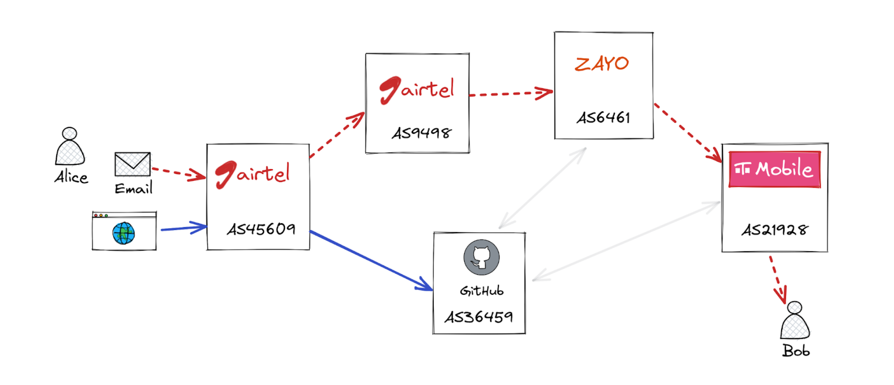
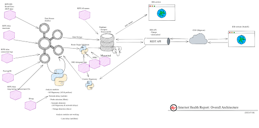
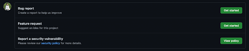

<h1 align='center'> The Internet Health Report: Handbook for Contributors  </h1>

# **1. Why this handbook?**
The goal of this handbook is to give a very brief overview of the Internet Health
Report project and guidelines to contribute to this open-source organisation.  

# **2. How does the Internet work?**
Browsing the IHR website, and consequently contributing to IHR, requires basic networking knowledge. 
This section covers the most basic concepts that are needed for you to start your journey at IHR.

## 2.1 The basics of Internet routing
The internet is like a giant network that connects millions of computers and devices all around the world. It is usually referred to as “the network of networks” because it is one global entity composed of thousands of smaller heterogeneous networks that are interconnected. 

When you access a website or send an email, your device sends packets of data over the internet to the server hosting the website or the recipient of the email. These packets pass through several different networks before they reach their destination. 
Fig.1 shows an example where Alice is sending an email to her friend Bob, and she is also browsing Github’s website. Alice is connected to the Internet with Airtel and Bob is using T-Mobile. Alice’s email has to go over multiple networks to reach Bob (red dashed lines), it starts at Airtel mobile network, then Airtel’s international network and another international network Zayo, to finally reach T-Mobile and Bob.
Her request to Github takes a much shorter path, as it goes only through the Airtel and Github networks.

**Fig.1** *Overview of the Internet. Alice sends an email to Bob (red dashed lines) and browses github’s website.*

This simple example illustrates two key concepts: 
1) A company (e.g. Airtel) may operate multiple networks. Because the term network is quite vague, experts call these **Autonomous Systems (AS)**. An AS is a collection of routers that are operated by a single organization and is identified by a unique number called an Autonomous System Number (ASN). Companies may operate different ASes to distinguish their different services. For example, AS45609 is used for Airtel’s mobile service and AS9498 for Airtel’s international connectivity.
2) There is a shorter path from Alice to Bob that passes through Github. But the email is not taking this path, most likely because Github’s network is designed mainly for traffic to/from Github servers. The path has been discovered using a protocol to find the best routes between two places on the Internet, the **Border Gateway Protocol (BGP).** BGP is a set of rules that helps these autonomous systems communicate with each other and share information about how to reach different parts of the internet. It's kind of like a big map that tells each autonomous system where to send its data to reach its final destination. BGP allows routers to dynamically adjust their routing decisions in response to changes in the network topology, such as the addition or removal of an AS or link between ASes.

The above example is very simple compared to the real lnternet which is composed of over 70 thousands ASes and is always evolving. But the principles are the same,  every AS connected to the Internet has to cooperate with other ASes to connect online users and services. That also means that the connectivity and reachability of an AS depend on these other ASes that help it to reach the rest of the Internet.

## 2.2 Terminology
### Autonomous System (AS and ASN)
An Autonomous System (AS) is a computer network that is managed by a single organization or company. Each AS is assigned a unique identifier, called an Autonomous System Number (ASN), which is used to identify it on the internet. The ASN is used by BGP to enable routers to exchange information about the best paths to use when routing traffic between different ASes.
ASes are responsible for routing traffic within their own network and between their network and other networks on the internet. They are often assigned IP address ranges by Internet Registries, which they use to identify the devices and services within their network.
ASes can be divided into two types: transit ASes and stub ASes. Transit ASes are those that allow traffic to pass through them to reach other networks, while stub ASes only route traffic within their own network.

### AS Hegemony
AS Hegemony is a metric that measures the ASes inter-dependency. As explained in 2.1, an AS may rely on other ASes to reach the rest of the Internet. For example, Airtel mobile (AS45609) sends and receives international traffic only via Airtel’s international network (AS9498), hence its dependency (or AS Hegemony value) to AS9498 is very high. Connectivity issues at AS9498 are likely to impact the connectivity of AS45609.

### BGP
BGP stands for Border Gateway Protocol. It is a routing protocol used by Internet Service Providers (ISPs) to exchange information about the paths that data packets should take to reach their destination on the internet.

BGP is responsible for routing traffic between different autonomous systems (ASes), which are networks operated by different organizations or companies. When a packet is sent from one AS to another, BGP determines the most efficient path for the packet to take based on a number of factors, such as the number of network hops required and the speed of each network link.
BGP allows ISPs to exchange information about these paths and make routing decisions based on that information. This helps to ensure that data packets are delivered quickly and efficiently across the internet.

### IP Prefix
An IP prefix is a range of IP addresses that are assigned to a particular network. It is represented by an IP address and a subnet mask, which determines the size of the range of IP addresses.
For example, the IP address range 192.168.0.0/24 represents a range of 256 IP addresses, from 192.168.0.1 to 192.168.0.255. The subnet mask "/24" means that the first 24 bits of the IP address are used to identify the network, and the remaining 8 bits are used to identify the device within that network.
IP prefixes are used in routing to determine the most efficient path for data packets to take between networks. When a packet is sent from one device to another, routers use the IP prefix to determine which network the destination device is on, and then use routing protocols like BGP to determine the best path for the packet to take to reach its destination.
### Internet Topology 
The physical or logical arrangement of ASes and connections between these ASes. Think of it as a map of the Internet.
### Peering
The act of two or more ASes connecting their networks together to exchange traffic directly, rather than through other networks.
### RIPE Atlas
RIPE Atlas is a global network measurement platform that allows users to measure and monitor various aspects of the Internet, such as network connectivity, performance, and reachability.
It works by distributing small, portable measurement devices (called "probes") to volunteers around the world, who then connect them to their local network. These probes send and receive network traffic (e.g. pings and traceroutes), allowing RIPE Atlas users to collect and analyze data on how the Internet is functioning in different parts of the world.

IHR can use this data to troubleshoot network issues, measure latency between different parts of the world, or study the behavior of the Internet as a whole. The platform provides an API to help users collect and analyze this data in a meaningful way. See also [https://atlas.ripe.net/](https://atlas.ripe.net/).

### RTT / Network delay
RTT stands for Round-Trip Time, which is a measurement of the time it takes for a data packet to travel from a source device to a destination device, and then back to the source device.
In other words, it measures the time it takes for a signal or packet to travel from point A to point B, and then back to point A again. RTT is usually measured in milliseconds (ms), and is an important metric for measuring network latency and performance.

# **3. What is the Internet Health Report (IHR)?**
## 3.1. The Problems we solve

Understanding and monitoring Internet topology is crucial to troubleshoot connectivity issues, improve resiliency, and understand the evolution of the Internet. There are measurement platforms (e.g RIPE Atlas) that can help in these regards, but they mostly provide raw data that need to be processed to get real insights, and this is not an easy task because the volume and velocity of these datasets are quite daunting.
The Internet Health Report (IHR) aims to fill this gap by providing an analytics platform for Internet infrastructure data. At its core, IHR ingests mainly BGP and traceroute data and computes network metrics such as AS Hegemony and RTTs. These are then presented in the form of interactive reports on the [IHR website](https://ihr.iijlab.net). There are currently three types of reports, the [global report](https://ihr.iijlab.net/ihr/en-us/global_report) contains recent anomalies identified across all networks, and [country](https://ihr.iijlab.net/ihr/en-us/countries) and [network](https://ihr.iijlab.net/ihr/en-us/networks/) display all computed metrics for a certain country or AS.

## 3.2. Our Vision
We envision IHR as an observatory for Internet topology. It helps us to understand how each part of the world is connected to the Internet and how this changes over time. IHR aims to be the OpenStreetMap for the Internet. Our plan is to integrate more open datasets in IHR and make IHR accessible to a broader audience with simpler visualization tools.

## 3.3. The Projects of IHR
Here we give a brief overview of the different projects that are under the umbrella of IHR. All these projects are entirely open source and available on github:[https://github.com/InternetHealthReport/](https://github.com/InternetHealthReport/) 
Also the data produced by IHR is publicly available via the API ([https://ihr.iijlab.net/ihr/en-us/api](https://ihr.iijlab.net/ihr/en-us/api) and IHR’s archive website ([https://ihr-archive.iijlab.net/](https://ihr-archive.iijlab.net/)). 

## Overview of the main projects

IHR’s analytics platform is designed around a Kafka cluster that:
- Ingests raw data (e.g. traceroute, BGP data) from measurement platforms (e.g. RIPE Atlas, RIS, Routeviews).
- It then serves these datasets to analysis modules which in return push back processed data to Kafka.
The processed data is archived in the IHR database and made publicly available via IHR’s API. IHR website is fetching data from this API.

### kafka-toolbox 
https://github.com/InternetHealthReport/kafka-toolbox

Most of the raw datasets are imported to kafka using scripts that are in the kafka-toolbox repository. This repository also contains handy scripts to read data from the kafka cluster.

This repository also contains code for our generic anomaly detector. This code monitors a numeric value from a kafka topic and reports outlier values. The data for all API endpoints that end with /alarms/ is obtained with this code (with the exception of the link/delay/alarms and link/forwarding/alarms, see tartiflette below).

This repository also contains a simple script (ASHegemony\_prefix.py) that fetch prefixes’ AS Hegemony values from kafka, check the validity of the routes in RPKI, IRR, delegated files, and produces the data referred to as *Route origin validation* on IHR website and available at the /hegemony/prefixes API endpoint.

### as-hegemony
https://github.com/InternetHealthReport/as-hegemony

This is the code to compute AS Hegemony. It consists of multiple processing steps to get from BGP data to AS Hegemony values. It can compute both AS Hegemony of ASes and prefixes. This code produces all data for the /hegemony API.

### raclette
https://github.com/InternetHealthReport/raclette

This code extracts network delays from traceroute data. It reads traceroute data from kafka and computes the latency between ASes and cities found in traceroutes. The results of raclette is referred on IHR website as *Network delay* and available at the /network\_delay/ API endpoint.

### disco
https://github.com/InternetHealthReport/disco-kafka

This code infers Internet outages from traceroute data, it produces results that appear as *Network disconnections* on IHR website and the /disco/ API endpoint.

### tartiflette
https://github.com/InternetHealthReport/tartiflette

This code detects delay and forwarding anomalies in traceroute data, it produces results that appear as *Link delay and forwarding anomalies.* This code is currently not running as it needs substantial refactoring.

### country-as-hegemony
https://github.com/InternetHealthReport/country-as-hegemony

This code computes AS Hegemony for all ASes in the same country. This is one of the only module that doesn’t read data from kafka, it obtains data from IHR and APNIC APIs. The corresponding results are available in the /hegemony/countries API endpoint and referred to as *Network Dependency* in the country reports of the IHR website.

### psql-dump
https://github.com/InternetHealthReport/psql-dump

This is a simple script that dumps data from the IHR database to the csv files. This is used to create the files available at https://ihr-archive.iijlab.net/.

### ihr-django
https://github.com/InternetHealthReport/ihr-django

This is the code of the IHR API, it makes the link between the IHR database and the IHR website. 

### ihr-website
https://github.com/InternetHealthReport/ihr-website

This is the code for IHR’s main website: https://ihr.iijlab.net. The main goal of the IHR website is to expose the data processed by IHR analysis modules and make this data easily accessible to a larger audience.

### internet-yellow-pages
https://github.com/InternetHealthReport/internet-yellow-pages

The Internet Yellow Pages (IYP) aims to fetch and organize the vast amount of public Internet topology data available online and organize these datasets in a knowledge database (powered by Neo4j). This project is not yet integrated with the rest of the IHR platform but it will be in the near future.

# **4. Contributing to IHR**

## 4.1. Why contribute?

The Internet is a world-wide joint effort to make a global communication infrastructure. We would like to pursue this collaborative spirit in our mission to monitor the Internet infrastructure. Contributing to IHR means that you’ll have a chance to develop tools that could be used by any network operators, researchers, and scientists around the globe in their quest to monitor and document the Internet infrastructure. 
For students it is also a chance to work on an Open Source project and learn about how the Internet works. 

There are numerous ways to contribute to IHR:
- **Researchers** can integrate their own Internet measurement analysis modules or results to the IHR platform or website and we’ll be glad to assist them to do so. We are also very open to collaborations for any project related to Internet measurements and studies using IHR data.
- **Network operators, policy makers, and all users** of IHR website and datasets are more than welcome to send their feedback and desired features. We are also particularly interested to hear how we can improve and make IHR more useful.
- **UI/UX Designers and Software Developers** are needed to develop and improve IHR tools. Undoubtedly UX is important for us to get the most out of IHR data. We welcome any suggestions to improve the user experience on the IHR website. Software developers are welcome to collaborate with us on Github to improve our tools and develop new features. 
- **Technical Writers** are welcome to document any of the events and insights found in IHR data. Writing documentation for our tools or data is also a great contribution to IHR.

## 4.2. (no) Prerequisites

Anyone can contribute. Of course it depends on your skills, but remember there is no small contribution. A bug report, documentation improvement, a feature request are all valuable contributions. If you want to dive into the IHR code base, we are mostly using  JavaScript (Vue.js)  for the frontend and Python for the backend. 

## 4.3 How to contribute?

### Send your feedback

Please send your feedback using Github’s issues, so that we can discuss it online and keep track of it. In case you don’t know for which repository you should fill the issue then just send us an email at **admin@ihr.live**.

### Software development

For software development, please discuss the changes you wish to make using the github issues of the repository before making a change. This avoids that several people are working on the same feature at the same time. 

For creating an issue. Head over to the issues tab in any repository where you plan to contribute. And click on **New Issue Button**. Some of our repositories have templates for issues. For example, for IHR website you get 3 options to choose from: Feature Request, Bug Report, and Report a Security Vulnerability. 

Follow the issue template while creating the issue.

In case, you want to contribute but have no issue in mind. Solve the existing issues! Some of our issues are tagged for beginners. You can find them with the following search terms:
*is:issue is:open label:beginner-friendly*  or *is:issue is:open label:"good first issue"* 

While contributing please refer to the project's style and contribution guidelines for submitting patches and additions. In general, we follow the **"fork-and-pull"** Git workflow:
- Fork the repository on GitHub
- Clone the project to your machine
- Create a branch and name it with the issue number
- Commit changes to the branch
- Push your work back to your fork
- Rebase your branch with the master branch
- Submit your Pull Request so that we can review it
The working repositories are listed on https://github.com/InternetHealthReport, follow to get notified. 

## 4.4 IHR Code of Conduct
By participating in IHR, you are expected to follow our [Code of Conduct](https://github.com/InternetHealthReport/ihr-website/blob/master/CODE_OF_CONDUCT.md). Please report unacceptable behavior to admin@ihr.live. 

# 5. Join Us
As you could guess most of the interaction for contributing to IHR happens on our github: 
https://github.com/InternetHealthReport/

You can also find us on slack:
https://join.slack.com/t/internethealthreport/shared_invite/zt-19d4e48py-~oirVwkINe01gTVEF3o4Kw

Or just get in touch with us by email: **admin@ihr.live**

# 6. Further reading & watching
For those interested to learn more about how the Internet works, here is a list of resources available on the web.

## Blogs
- [The](https://labs.ripe.net/author/romain_fontugne/the-internet-health-report/)[Internet](https://labs.ripe.net/author/romain_fontugne/the-internet-health-report/)[Health](https://labs.ripe.net/author/romain_fontugne/the-internet-health-report/)[Report](https://labs.ripe.net/author/romain_fontugne/the-internet-health-report/)[, ](https://labs.ripe.net/author/romain_fontugne/the-internet-health-report/)[RIPE](https://labs.ripe.net/author/romain_fontugne/the-internet-health-report/)[Labs](https://labs.ripe.net/author/romain_fontugne/the-internet-health-report/)
- APNIC’s ‘Basic routing concepts’ series:
  - [Part](https://blog.apnic.net/2021/09/01/routing-concepts-you-may-have-forgotten-part-1-prefixes/)[ 1: ](https://blog.apnic.net/2021/09/01/routing-concepts-you-may-have-forgotten-part-1-prefixes/)[Prefixes](https://blog.apnic.net/2021/09/01/routing-concepts-you-may-have-forgotten-part-1-prefixes/)
  - [Part](https://blog.apnic.net/2021/09/10/routing-concepts-you-may-have-forgotten-part-2-bgp-is-just-harnessing-gossip/)[ 2: ](https://blog.apnic.net/2021/09/10/routing-concepts-you-may-have-forgotten-part-2-bgp-is-just-harnessing-gossip/)[BGP](https://blog.apnic.net/2021/09/10/routing-concepts-you-may-have-forgotten-part-2-bgp-is-just-harnessing-gossip/)[is](https://blog.apnic.net/2021/09/10/routing-concepts-you-may-have-forgotten-part-2-bgp-is-just-harnessing-gossip/)[just](https://blog.apnic.net/2021/09/10/routing-concepts-you-may-have-forgotten-part-2-bgp-is-just-harnessing-gossip/)[harnessing](https://blog.apnic.net/2021/09/10/routing-concepts-you-may-have-forgotten-part-2-bgp-is-just-harnessing-gossip/)[gossip](https://blog.apnic.net/2021/09/10/routing-concepts-you-may-have-forgotten-part-2-bgp-is-just-harnessing-gossip/)
  - [Part](https://blog.apnic.net/2021/09/16/part-3-trust-but-verify-bgp/)[ 3: ](https://blog.apnic.net/2021/09/16/part-3-trust-but-verify-bgp/)[Trust](https://blog.apnic.net/2021/09/16/part-3-trust-but-verify-bgp/)[but](https://blog.apnic.net/2021/09/16/part-3-trust-but-verify-bgp/)[verify](https://blog.apnic.net/2021/09/16/part-3-trust-but-verify-bgp/)[BGP](https://blog.apnic.net/2021/09/16/part-3-trust-but-verify-bgp/)
## Textbook
- [“](https://open.umn.edu/opentextbooks/textbooks/352)[Computer](https://open.umn.edu/opentextbooks/textbooks/352)[Networking](https://open.umn.edu/opentextbooks/textbooks/352)[ : ](https://open.umn.edu/opentextbooks/textbooks/352)[Principles](https://open.umn.edu/opentextbooks/textbooks/352)[, ](https://open.umn.edu/opentextbooks/textbooks/352)[Protocols](https://open.umn.edu/opentextbooks/textbooks/352)[and](https://open.umn.edu/opentextbooks/textbooks/352)[Practice](https://open.umn.edu/opentextbooks/textbooks/352)[” ](https://open.umn.edu/opentextbooks/textbooks/352)[from](https://open.umn.edu/opentextbooks/textbooks/352)[Olivier](https://open.umn.edu/opentextbooks/textbooks/352)[Bonaventure](https://open.umn.edu/opentextbooks/textbooks/352)
- [“](https://gaia.cs.umass.edu/kurose_ross/eighth.php)[Computer](https://gaia.cs.umass.edu/kurose_ross/eighth.php)[Networking](https://gaia.cs.umass.edu/kurose_ross/eighth.php)[: ](https://gaia.cs.umass.edu/kurose_ross/eighth.php)[A](https://gaia.cs.umass.edu/kurose_ross/eighth.php)[Top](https://gaia.cs.umass.edu/kurose_ross/eighth.php)[-](https://gaia.cs.umass.edu/kurose_ross/eighth.php)[Down](https://gaia.cs.umass.edu/kurose_ross/eighth.php)[Approach](https://gaia.cs.umass.edu/kurose_ross/eighth.php)[” ](https://gaia.cs.umass.edu/kurose_ross/eighth.php)[from](https://gaia.cs.umass.edu/kurose_ross/eighth.php)[Jim](https://gaia.cs.umass.edu/kurose_ross/eighth.php)[Kurose](https://gaia.cs.umass.edu/kurose_ross/eighth.php)[and](https://gaia.cs.umass.edu/kurose_ross/eighth.php)[Keith](https://gaia.cs.umass.edu/kurose_ross/eighth.php)[Ross](https://gaia.cs.umass.edu/kurose_ross/eighth.php)

## Videos
- [BGP](https://www.youtube.com/watch?v=_Z29ZzKeZHc)[Overview](https://www.youtube.com/watch?v=_Z29ZzKeZHc)
- [Sharon](https://www.youtube.com/watch?v=PQoa2coBCDs)[Goldberg](https://www.youtube.com/watch?v=PQoa2coBCDs)[on](https://www.youtube.com/watch?v=PQoa2coBCDs)[BGP](https://www.youtube.com/watch?v=PQoa2coBCDs)[: ](https://www.youtube.com/watch?v=PQoa2coBCDs)[A](https://www.youtube.com/watch?v=PQoa2coBCDs)[Primer](https://www.youtube.com/watch?v=PQoa2coBCDs)
- [Playlist](https://youtube.com/playlist?list=PLm556dMNleHc1MWN5BX9B2XkwkNE2Djiu)[: ](https://youtube.com/playlist?list=PLm556dMNleHc1MWN5BX9B2XkwkNE2Djiu)[Computer](https://youtube.com/playlist?list=PLm556dMNleHc1MWN5BX9B2XkwkNE2Djiu)[Networking](https://youtube.com/playlist?list=PLm556dMNleHc1MWN5BX9B2XkwkNE2Djiu)[: ](https://youtube.com/playlist?list=PLm556dMNleHc1MWN5BX9B2XkwkNE2Djiu)[A](https://youtube.com/playlist?list=PLm556dMNleHc1MWN5BX9B2XkwkNE2Djiu)[Top](https://youtube.com/playlist?list=PLm556dMNleHc1MWN5BX9B2XkwkNE2Djiu)[-](https://youtube.com/playlist?list=PLm556dMNleHc1MWN5BX9B2XkwkNE2Djiu)[Down](https://youtube.com/playlist?list=PLm556dMNleHc1MWN5BX9B2XkwkNE2Djiu)[Approach](https://youtube.com/playlist?list=PLm556dMNleHc1MWN5BX9B2XkwkNE2Djiu) 
- And a lot more on youtube.

